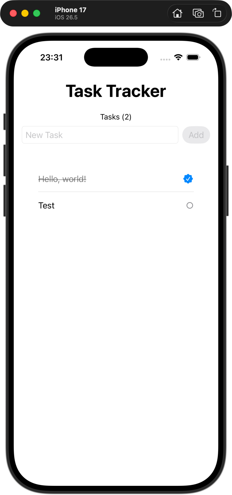

> **EN:** SwiftUI task tracker app using SwiftData to persist tasks, `@Query` to keep the list reactive, and simple animations for adding, deleting, counting, and marking tasks as completed. Built in Xcode.
>
> *The rest of this README is in Brazilian Portuguese (pt-BR).*

---

# Task Tracker (SwiftUI)

App desenvolvido em **SwiftUI** para gerenciar uma lista simples de tarefas. O projeto usa **SwiftData** para persistencia local, **`@Query`** para atualizar a interface automaticamente e **`@State`** para controlar o texto digitado no campo de nova tarefa.

## Status

**Em desenvolvimento** — Cadastro de tarefas, listagem, contador animado, remocao por swipe e marcacao de tarefas concluidas ja implementados.

## Em que consiste

O projeto e construido sobre tres partes principais:

- **`Task`** — Modelo de dados criado com `@Model`, contendo `id`, `title` e `iscompleted`. Esse modelo representa cada tarefa salva pelo SwiftData.
- **`ContentView`** — Tela principal do app. Ela exibe o titulo, contador de tarefas, campo para adicionar novas tarefas e uma `List` com todas as tarefas persistidas.
- **`TaskTrackerApp`** — Ponto de entrada do app. Ele configura o container do SwiftData com `.modelContainer(for: Task.self)`, permitindo que `@Query` e `modelContext` funcionem corretamente.

### Funcionalidades

- Adicionar novas tarefas usando `TextField` e botao **Add**.
- Desabilitar o botao quando o campo esta vazio.
- Exibir contador de tarefas com animacao numerica.
- Marcar tarefas como concluidas ao tocar no item.
- Alterar visualmente tarefas concluidas com texto riscado, cor secundaria e icone preenchido.
- Remover tarefas usando swipe na lista.
- Usar fundo branco na lista com `.scrollContentBackground(.hidden)`.
- Persistir os dados localmente com SwiftData.

### Fluxo de dados

```text
TaskTrackerApp
│
│ .modelContainer(for: Task.self)
▼
ContentView
│
├── @Query le as tarefas salvas
├── @State controla o texto da nova tarefa
└── modelContext insere e remove tarefas
    │
    ├── addTask() → salva uma nova Task
    ├── toggleTask() → alterna concluida/pendente
    └── removeTasks() → deleta tarefas selecionadas
```

## Como executar

### Pre-requisitos

* macOS com Xcode instalado
* Xcode 15 ou superior
* iOS SDK compativel com SwiftData

### Passo a passo

1. Clone este repositorio ou baixe os arquivos do projeto.
2. Abra o arquivo `TaskTracker.xcodeproj` no Xcode.
3. Selecione um simulador de iPhone.
4. Execute o app com `Command + R`.
5. Para visualizar pelo Canvas, abra `ContentView.swift` e use `Option + Command + P`.

## Preview da Interface

<p align="center">
  
</p>

